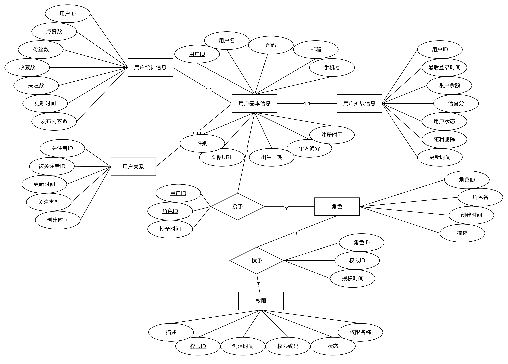
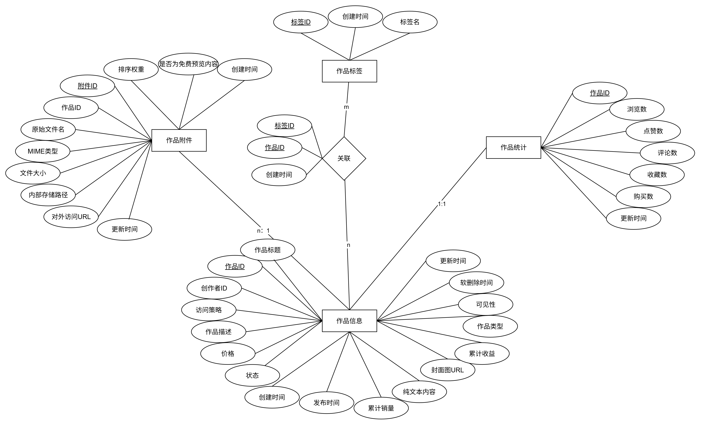
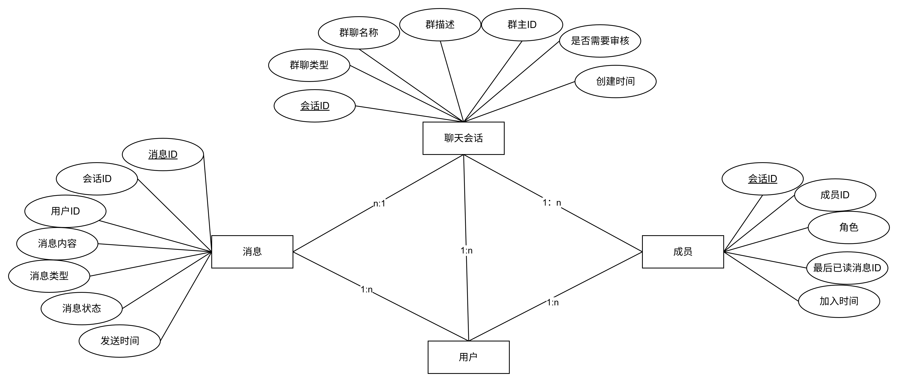
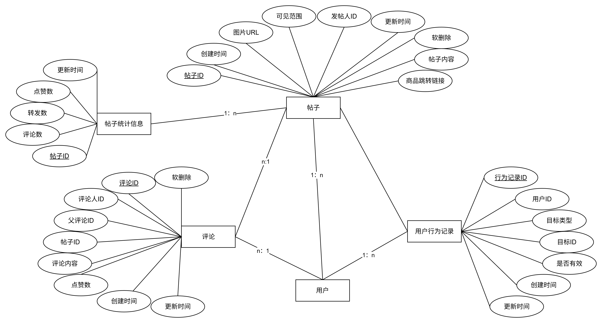
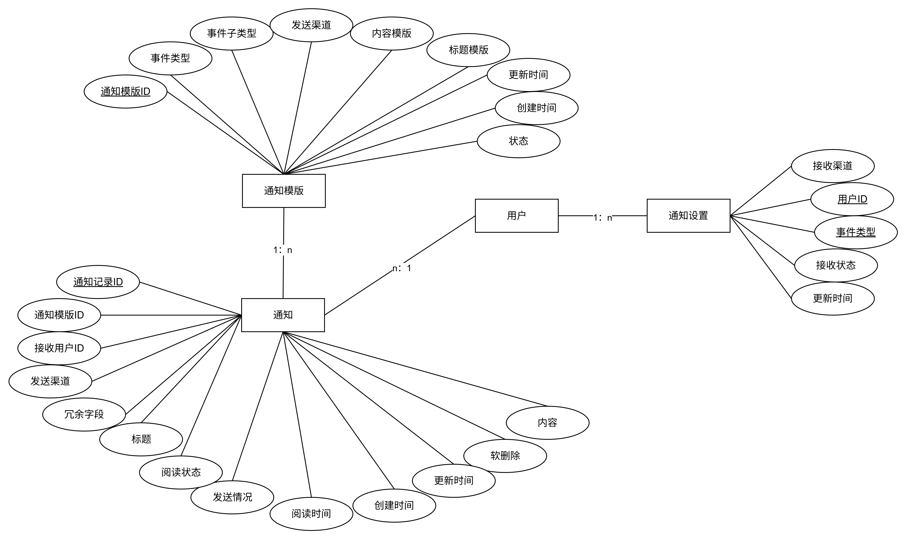

# 【知创空间】 - 数据库设计文档

## 1.1 文档概述

- 版本：V1.0
- 创建日期：2025-10-19
- 状态：草稿

## 1.2 需求分析

## 1.3  概念结构设计

   
                                                                                                                      **图 1 用户模块E-R图**  
  
                                                                                                                      **图 2 用户模块E-R图**
   
                                                                                                                      **图 3 用户模块E-R图**

   
                                                                                                                      **图 4 用户模块E-R图**
   
                                                                                                                      **图 5 用户模块E-R图**
   
                                                                                                                      **图 6 用户模块E-R图**

## 1.4 逻辑结构设计

### 1.4.1用户模块

##### 1. 用户基本信息表 (user_profile)

| 字段名           | 类型              | 长度  | 主键  | 非空  | 默认值               | 说明           |
| ------------- | --------------- | --- | --- | --- | ----------------- | ------------ |
| user_id       | BIGINT UNSIGNED | -   | ✅   | ✅   | -                 | 用户ID（雪花ID）   |
| username      | VARCHAR         | 50  | -   | ✅   | -                 | 用户名          |
| password      | VARCHAR         | 100 | -   | ✅   | -                 | 密码           |
| email         | VARCHAR         | 100 | -   | ✅   | -                 | 邮箱           |
| phone         | CHAR            | 11  | -   | ✅   | -                 | 手机号（11位），唯一  |
| gender        | TINYINT         | -   | -   | ✅   | 0                 | 性别：0未知，1男，2女 |
| birth_date    | DATE            | -   | -   | ❌   | NULL              | 出生日期         |
| bio           | VARCHAR         | -   | -   | 255 | NULL              | 个人简介         |
| avatar_url    | VARCHAR         | 255 | -   | ❌   | NULL              | 头像URL        |
| register_time | DATETIME        | -   | -   | ✅   | CURRENT_TIMESTAMP | 注册时间         |

**索引：**

- 主键索引：`user_id`
- 唯一索引：`username`, `email`, `phone`
- 普通索引：`idx_username(username)`, `idx_email(email)`, `idx_phone(phone)` 

##### 2. 用户扩展信息表 (user_expansion)

| 字段名             | 类型              | 长度   | 主键  | 非空  | 默认值               | 说明                   |
| --------------- | --------------- | ---- | --- | --- | ----------------- | -------------------- |
| user_id         | BIGINT UNSIGNED | -    | ✅   | ✅   | -                 | 用户ID（雪花ID）           |
| last_login_time | DATETIME        | -    | -   | ✅   | CURRENT_TIMESTAMP | 最后登录时间               |
| balance         | DECIMAL         | 12,2 | -   | ✅   | 0.00              | 账户余额（单位：元）           |
| credit_score    | INT             | -    | -   | ✅   | 100               | 信誉分                  |
| user_status     | TINYINT         | -    | -   | ✅   | 0                 | 用户状态：0正常，1禁言，2封禁，3注销 |
| is_deleted      | TINYINT(1)      | -    | -   | ✅   | 0                 | 逻辑删除：0否，1是           |
| update_time     | DATETIME        | -    | -   | ✅   | CURRENT_TIMESTAMP | 更新时间                 |

**索引：**

- 主键索引：`user_id`
  
  

##### 3. 用户统计表 (user_stats)

| 字段名                                         | 类型              | 长度  | 主键  | 非空  | 默认值               | 说明    |
| ------------------------------------------- | --------------- | --- | --- | --- | ----------------- | ----- |
| user_id                                     | BIGINT UNSIGNED | -   | ✅   | ✅   | -                 | 用户ID  |
| likes_count                                 | INT             | -   | -   | ✅   | 0                 | 点赞数   |
| fans_count                                  | INT             | -   | -   | ✅   | 0                 | 粉丝数   |
| followings_count                            | INT             | -   | -   | ✅   | 0                 | 关注数   |
| favorites_count | INT             | -   | -   | ✅   | 0                 | 收藏数   |
| posts_count                                 | INT             | -   | -   | ✅   | 0                 | 发布内容数 |
| update_time                                 | DATETIME        | -   | -   | ✅   | CURRENT_TIMESTAMP | 更新时间  |

**索引：**

- 主键索引：`user_id`
  
  

##### 4. 用户关系表 (user_relationship)

| 字段名         | 类型              | 长度  | 主键  | 非空  | 默认值               | 说明                      |
| ----------- | --------------- | --- | --- | --- | ----------------- | ----------------------- |
| follower_id | BIGINT UNSIGNED | -   | ✅   | ✅   | -                 | 关注者ID                   |
| followee_id | BIGINT UNSIGNED | -   | ✅   | ✅   | -                 | 被关注人ID                  |
| follow_type | TINYINT         | -   | -   | ✅   | 1                 | 关系类型（0取关，1关注，2特别关注，3拉黑） |
| follow_time | DATETIME        | -   | -   | ✅   | CURRENT_TIMESTAMP | 创建时间                    |
| update_time | DATETIME        | -   | -   | ✅   | CURRENT_TIMESTAMP | 更新时间                    |

**索引：**

- 复合主键：`(follower_id, followee_id)`
- 普通索引：`idx_followee(followee_id)`, `idx_follower(follower_id)`

**约束：**

- 禁止自关注：`follower_id != followee_id`
  
  

##### 5. 权限字典表 (permission)

| 字段名                    | 类型              | 长度  | 主键  | 非空  | 默认值               | 说明                  |
| ---------------------- | --------------- | --- | --- | --- | ----------------- | ------------------- |
| permission_id          | BIGINT UNSIGNED | -   | ✅   | ✅   | AUTO_INCREMENT    | 权限ID                |
| permission_code        | VARCHAR         | 100 | -   | ✅   | -                 | 权限编码（如user:read），唯一 |
| permission_name        | VARCHAR         | 100 | -   | ✅   | -                 | 权限名称                |
| permission_description | VARCHAR         | 255 | -   | ❌   | NULL              | 描述                  |
| create_time            | DATETIME        | -   | -   | ✅   | CURRENT_TIMESTAMP | 创建时间                |
| status                 | TINYINT(1)      | -   | -   | ✅   | 1                 | 状态：1启用，0禁用          |

**索引：**

- 主键索引：`permission_id`
- 唯一索引：`permission_code`
- 普通索引：`idx_code(permission_code)`, `idx_status(status)`
  
  

##### 6. 角色表 (role)

| 字段名              | 类型              | 长度  | 主键  | 非空  | 默认值               | 说明      |
| ---------------- | --------------- | --- | --- | --- | ----------------- | ------- |
| role_id          | BIGINT UNSIGNED | -   | ✅   | ✅   | AUTO_INCREMENT    | 角色ID    |
| permission_code  | VARCHAR         | 100 | -   | ✅   | -                 | 角色编码，唯一 |
| role_name        | VARCHAR         | 50  | -   | ✅   | -                 | 角色名     |
| role_description | VARCHAR         | 255 | -   | ❌   | NULL              | 描述      |
| create_time      | DATETIME        | -   | -   | ✅   | CURRENT_TIMESTAMP | 创建时间    |
| update_time      | DATETIME        | -   | -   | ✅   | CURRENT_TIMESTAMP | 更新时间    |

**索引：**

- 主键索引：`role_id`
- 唯一索引：`role_name`
- 普通索引：`idx_role_name(role_name)`
  
  

##### 7. 角色-权限关联表 (role_permission)

| 字段名           | 类型              | 长度  | 主键  | 非空  | 默认值               | 说明   |
| ------------- | --------------- | --- | --- | --- | ----------------- | ---- |
| role_id       | BIGINT UNSIGNED | -   | ✅   | ✅   | -                 | 角色ID |
| permission_id | BIGINT UNSIGNED | -   | ✅   | ✅   | -                 | 权限ID |
| grant_time    | DATETIME        | -   | -   | ✅   | CURRENT_TIMESTAMP | 授权时间 |

**索引：**

- 复合主键：`(role_id, permission_id)`
- 普通索引：`idx_role(role_id)`, `idx_permission(permission_id)`
  
  

##### 8. 用户-角色关联表 (user_role)

| 字段名        | 类型              | 长度  | 主键  | 非空  | 默认值               | 说明   |
| ---------- | --------------- | --- | --- | --- | ----------------- | ---- |
| user_id    | BIGINT UNSIGNED | -   | ✅   | ✅   | -                 | 用户ID |
| role_id    | BIGINT UNSIGNED | -   | ✅   | ✅   | -                 | 角色ID |
| grant_time | DATETIME        | -   | -   | ✅   | CURRENT_TIMESTAMP | 授权时间 |

**索引：**

- 复合主键：`(user_id, role_id)`
- 普通索引：`idx_user(user_id)`, `idx_role(role_id)`

---

### 1.4.2 作品模块

##### 1. 作品信息表 (work_info)

| 字段名             | 类型       | 长度   | 主键  | 非空  | 默认值               | 说明                                 |
| --------------- | -------- | ---- | --- | --- | ----------------- | ---------------------------------- |
| work_id         | BIGINT   | -    | ✅   | ✅   |                   | 作品ID                               |
| creator_id      | BIGINT   | -    | -   | ✅   | -                 | 创作者ID                              |
| title           | VARCHAR  | 255  | -   | ✅   | -                 | 作品标题                               |
| type            | VARCHAR  | 50   | -   | ✅   | -                 | 作品类型：article, video, ebook, course |
| description     | TEXT     | -    | -   | ❌   | NULL              | 作品描述                               |
| cover_url       | VARCHAR  | 512  | -   | ❌   | NULL              | 封面图URL                             |
| content         | LONGTEXT | -    | -   | ❌   | NULL              | 纯文本内容                              |
| price           | DECIMAL  | 10,2 | -   | ✅   | 0.00              | 价格（单位：元）                           |
| access_strategy | TINYINT  | -    | -   | ✅   | 0                 | 访问策略：0=免费, 1=会员免费, 2=付费            |
| status          | TINYINT  | -    | -   | ✅   | 0                 | 状态：0-草稿,1-审核中,2-已发布,3-已下架,4-审核拒绝   |
| visibility      | TINYINT  | -    | -   | ✅   | 0                 | 可见性：0-公开,1-仅自己可见 2-保护 3-保密         |
| created_at      | DATETIME | -    | -   | ✅   | CURRENT_TIMESTAMP | 创建时间                               |
| published_at    | DATETIME | -    | -   | ❌   | NULL              | 发布时间                               |
| updated_at      | DATETIME | -    | -   | ✅   | CURRENT_TIMESTAMP | 更新时间                               |
| deleted_at      | DATETIME | -    | -   | ❌   | NULL              | 软删除时间                              |
| total_revenue   | DECIMAL  | 12,2 | -   | ✅   | 0.00              | 累计收益（元）                            |
| total_sales     | INT      | -    | -   | ✅   | 0                 | 累计销量                               |

**索引：**

- 主键索引：`id`
- 复合索引：`idx_creator_status (creator_id, status)`
- 复合索引：`idx_status_publish (status, published_at)`
- 普通索引：`idx_access_strategy (access_strategy)`
- 普通索引：`idx_created_at (created_at)`

##### 2. 作品统计表 (work_stats)

| 字段名            | 类型           | 长度  | 主键  | 非空  | 默认值               | 说明   |
| -------------- | ------------ | --- | --- | --- | ----------------- | ---- |
| work_id        | BIGINT       | -   | ✅   | ✅   | -                 | 作品ID |
| view_count     | INT UNSIGNED | -   | -   | ✅   | 0                 | 浏览数  |
| like_count     | INT UNSIGNED | -   | -   | ✅   | 0                 | 点赞数  |
| comment_count  | INT UNSIGNED | -   | -   | ✅   | 0                 | 评论数  |
| favorite_count | INT UNSIGNED | -   | -   | ✅   | 0                 | 收藏数  |
| purchase_count | INT UNSIGNED | -   | -   | ✅   | 0                 | 购买数  |
| updated_at     | DATETIME     | -   | -   | ✅   | CURRENT_TIMESTAMP | 更新时间 |

**索引：**

- 主键索引：`work_id`
- 普通索引：`idx_work_id (work_id)`

##### 3. 作品附件表 (work_attachment)

| 字段名             | 类型       | 长度  | 主键  | 非空  | 默认值               | 说明                       |
| --------------- | -------- | --- | --- | --- | ----------------- | ------------------------ |
| id              | BIGINT   | -   | ✅   | ✅   | AUTO_INCREMENT    | 附件ID                     |
| work_id         | BIGINT   | -   | -   | ✅   | -                 | 作品ID                     |
| file_name       | VARCHAR  | 255 | -   | ✅   | -                 | 原始文件名                    |
| file_extension  | VARCHAR  | 20  | -   | ✅   | -                 | 文件扩展名（如.pdf, .mp4）       |
| file_type       | VARCHAR  | 100 | -   | ✅   | -                 | MIME类型（如application/pdf） |
| file_size       | BIGINT   | -   | -   | ✅   | -                 | 文件大小（字节）                 |
| file_hash       | CHAR     | 64  | -   | ❌   | NULL              | 文件哈希值（SHA-256）           |
| bucket_name     | VARCHAR  | 63  | -   | ✅   | 'default'         | MinIO bucket名称           |
| object_key      | VARCHAR  | 512 | -   | ✅   | -                 | MinIO对象键                 |
| sort_order      | INT      | -   | -   | ✅   | 0                 | 排序权重                     |
| access_strategy | TINYINT  | -   | -   | ✅   | 0                 | 访问策略：0=公开, 1=会员, 2=付费    |
| created_at      | DATETIME | -   | -   | ✅   | CURRENT_TIMESTAMP | 创建时间                     |
| updated_at      | DATETIME | -   | -   | ✅   | CURRENT_TIMESTAMP | 更新时间                     |

##### 4. 标签主表 (tag)

| 字段名             | 类型       | 长度  | 主键  | 非空  | 默认值               | 说明   |
| --------------- | -------- | --- | --- | --- | ----------------- | ---- |
| tag_id          | BIGINT   | -   | ✅   | ✅   | AUTO_INCREMENT    | 标签ID |
| tag_name        | VARCHAR  | 50  | -   | ✅   | -                 | 标签名  |
| tag_type        | TINYINT  | -   | -   | ✅   | -                 | 标签类型 |
| tag_description | VARCHAR  | 50  | -   | ✅   | -                 | 标签描述 |
| created_at      | DATETIME | -   | -   | ✅   | CURRENT_TIMESTAMP | 创建时间 |
| updated_at      | DATETIME | -   | -   | ✅   | CURRENT_TIMESTAMP | 更新时间 |

**索引：**

- 主键索引：`tag_id`

##### 5. 作品标签关联表 (work_tag)

| 字段名        | 类型       | 长度  | 主键  | 非空  | 默认值               | 说明   |
| ---------- | -------- | --- | --- | --- | ----------------- | ---- |
| work_id    | BIGINT   | -   | ✅   | ✅   | -                 | 作品ID |
| tag_id     | BIGINT   | -   | ✅   | ✅   | -                 | 标签ID |
| created_at | DATETIME | -   | -   | ✅   | CURRENT_TIMESTAMP | 创建时间 |

**索引：**

- 复合主键：`(work_id, tag_id)`
- 普通索引：`idx_tag_id (tag_id)`

---

### 1.4.3 聊天模块

##### 1. 聊天会话表 (chat_rooms)

| 字段名              | 类型       | 长度  | 主键  | 非空  | 默认值               | 说明               |
| ---------------- | -------- | --- | --- | --- | ----------------- | ---------------- |
| room_id          | BIGINT   | -   | ✅   | ✅   | -                 | 会话ID（雪花ID）       |
| room_type        | TINYINT  | -   | -   | ✅   | 1                 | 1:群聊 2:单聊        |
| room_name        | VARCHAR  | 100 | -   | ❌   | ''                | 群聊名称；单聊可为空       |
| room_status      | TINYINT  | -   | -   | ✅   |                   | 房间状态：0正常，1封禁，2删除 |
| description      | VARCHAR  | 255 | -   | ❌   | ''                | 群描述（单聊忽略）        |
| require_approval | BOOLEAN  | -   | -   | ❌   | FALSE             | 入群是否需审核（仅群聊有效）   |
| created_by       | BIGINT   | -   | -   | ✅   | -                 | 创建者 user_id（群主）  |
| created_at       | DATETIME | -   | -   | ✅   | CURRENT_TIMESTAMP | 创建时间             |

**索引：**

- 主键索引：`room_id`
- 普通索引：`idx_created_by (created_by)`
- 普通索引：`idx_type (room_type)`
- 普通索引：`idx_created_at (created_at)`

---

##### 2. 会话成员表 (chat_room_members)

| 字段名              | 类型       | 长度  | 主键  | 非空  | 默认值               | 说明                 |
| ---------------- | -------- | --- | --- | --- | ----------------- | ------------------ |
| room_id          | BIGINT   | -   | ✅   | ✅   | -                 | 会话ID               |
| user_id          | BIGINT   | -   | ✅   | ✅   | -                 | 成员 user_id         |
| role             | TINYINT  | -   | -   | ✅   | 1                 | 1:普通成员 2:管理员 3:群主  |
| last_read_msg_id | BIGINT   | -   | -   | ❌   | 0                 | 最后已读的消息ID（用于未读数计算） |
| joined_at        | DATETIME | -   | -   | ✅   | CURRENT_TIMESTAMP | 加入时间               |
| is_online        | TINYINT  | -   | -   | ✅   |                   | 在线状态               |

**索引：**

- 复合主键：`(room_id, user_id)`
- 普通索引：`idx_user_id (user_id)`
- 普通索引：`idx_joined_at (joined_at)`
  
  

##### 3. 聊天消息表 (chat_messages)

| 字段名         | 类型       | 长度  | 主键  | 非空  | 默认值               | 说明                    |
| ----------- | -------- | --- | --- | --- | ----------------- | --------------------- |
| message_id  | BIGINT   | -   | ✅   | ✅   | -                 | 消息ID（雪花ID）            |
| room_id     | BIGINT   | -   | -   | ✅   | -                 | 所属会话ID                |
| sender_id   | BIGINT   | -   | -   | ✅   | -                 | 发送者ID                 |
| receiver_id | BIGINT   | -   | -   | ✅   | -                 | 接送者ID                 |
| content     | TEXT     | -   | -   | ✅   | -                 | 消息内容                  |
| msg_type    | TINYINT  | -   | -   | ✅   | 1                 | 1:文本 2:图片 3:文件 4:系统消息 |
| status      | TINYINT  | -   | -   | ✅   | 1                 | 1:正常 2:已撤回 3:已送达      |
| sent_at     | DATETIME | -   | -   | ✅   | CURRENT_TIMESTAMP | 发送时间                  |

**索引：**

- 主键索引：`message_id`
- 复合索引：`idx_room_sent (room_id, sent_at)`
- 普通索引：`idx_sender (sender_id)`
- 普通索引：`idx_sent_at (sent_at)`

---

### 1.4.4 论坛模块

##### 1. 帖子主表 (forum_posts)

| 字段名         | 类型       | 长度  | 主键  | 非空  | 默认值               | 说明                                   |
| ----------- | -------- | --- | --- | --- | ----------------- | ------------------------------------ |
| post_id     | BIGINT   | -   | ✅   | ✅   |                   | 帖子ID                                 |
| user_id     | BIGINT   | -   | -   | ✅   | -                 | 发帖人ID                                |
| title       | VARCHAR  | -   | -   | ✅   |                   | 标题                                   |
| content     | TEXT     | -   | -   | ❌   | NULL              | 帖子内容，支持文字和emoji                      |
| image_urls  | JSON     | -   | -   | ❌   | NULL              | 图片URL数组，例如 ["https://...jpg", "..."] |
| product_url | VARCHAR  | 500 | -   | ❌   | NULL              | 商品跳转链接                               |
| visibility  | TINYINT  | -   | -   | ❌   | 0                 | 可见范围(0公开，1私密，2好友可见)                  |
| is_deleted  | TINYINT  | -   | -   | ❌   | 0                 | 软删除：0=正常，1=已删                        |
| created_at  | DATETIME | -   | -   | ✅   | CURRENT_TIMESTAMP | 创建时间                                 |
| updated_at  | DATETIME | -   | -   | ✅   | CURRENT_TIMESTAMP | 更新时间                                 |

**索引：**

- 主键索引：`id`
- 复合索引：`idx_user_time (user_id, created_at DESC)`
- 普通索引：`idx_created_at (created_at DESC)`
- 普通索引：`idx_is_deleted (is_deleted)`

##### 2. 帖子统计表 (forum_post_stats)

| 字段名           | 类型           | 长度  | 主键  | 非空  | 默认值               | 说明   |
| ------------- | ------------ | --- | --- | --- | ----------------- | ---- |
| post_id       | BIGINT       | -   | ✅   | ✅   | -                 | 帖子ID |
| like_count    | INT UNSIGNED | -   | -   | ❌   | 0                 | 点赞总数 |
| collect_count | INT UNSIGNED | -   | -   | ❌   | 0                 | 收藏总数 |
| comment_count | INT UNSIGNED | -   | -   | ❌   | 0                 | 评论总数 |
| repost_count  | INT UNSIGNED | -   | -   | ❌   | 0                 | 转发总数 |
| view_count    | INT UNSIGNED | -   | -   | ❌   | 0                 | 浏览量  |
| updated_at    | DATETIME     | -   | -   | ✅   | CURRENT_TIMESTAMP | 更新时间 |

**索引：**

- 主键索引：`post_id`
- 普通索引：`idx_like_count (like_count DESC)`
- 普通索引：`idx_comment_count (comment_count DESC)`
- 普通索引：`idx_repost_count (repost_count DESC)`

##### 3. 评论表 (forum_comments)

| 字段名               | 类型           | 长度  | 主键  | 非空  | 默认值               | 说明                 |
| ----------------- | ------------ | --- | --- | --- | ----------------- | ------------------ |
| id                | BIGINT       | -   | ✅   | ✅   | -                 | 评论ID               |
| post_id           | BIGINT       | -   | -   | ✅   | -                 | 帖子ID               |
| user_id           | BIGINT       | -   | -   | ✅   | -                 | 评论人ID              |
| parent_comment_id | BIGINT       | -   | -   | ❌   | NULL              | 父评论ID，NULL表示直接评论帖子 |
| content           | TEXT         | -   | -   | ❌   | NULL              | 评论内容               |
| like_count        | INT UNSIGNED | -   | -   | ❌   | 0                 | 点赞数                |
| is_deleted        | TINYINT      | -   | -   | ❌   | 0                 | 软删除标记              |
| created_at        | DATETIME     | -   | -   | ✅   | CURRENT_TIMESTAMP | 创建时间               |
| updated_at        | DATETIME     | -   | -   | ✅   | CURRENT_TIMESTAMP | 更新时间               |

**索引：**

- 主键索引：`id`
- 复合索引：`idx_post_time (post_id, created_at ASC)`
- 普通索引：`idx_parent (parent_comment_id)`
- 复合索引：`idx_user_time (user_id, created_at DESC)`

##### 4. 用户行为记录表 (forum_user_actions)

| 字段名         | 类型       | 长度  | 主键  | 非空  | 默认值               | 说明                    |
| ----------- | -------- | --- | --- | --- | ----------------- | --------------------- |
| id          | BIGINT   | -   | ✅   | ✅   | -                 | 行为记录ID                |
| user_id     | BIGINT   | -   | -   | ✅   | -                 | 用户ID                  |
| target_type | TINYINT  | -   | -   | ✅   | -                 | 目标类型(1评论，2点赞，3收藏，4转发) |
| target_id   | BIGINT   | -   | -   | ✅   | -                 | 目标ID                  |
| is_active   | TINYINT  | -   | -   | ❌   | 1                 | 是否有效：1=激活，0=已取消       |
| created_at  | DATETIME | -   | -   | ✅   | CURRENT_TIMESTAMP | 创建时间                  |
| updated_at  | DATETIME | -   | -   | ✅   | CURRENT_TIMESTAMP | 更新时间                  |

**索引：**

- 主键索引：`id`
- 唯一索引：`uk_user_target (user_id, target_type, target_id)`必须
- 复合索引：`idx_target (target_type, target_id)`
- 复合索引：`idx_user_active (user_id, is_active)`

---

### 1.4.5 支付模块

##### 1. 订单主表 (pay_orders)

| 字段名             | 类型       | 长度   | 主键  | 非空  | 默认值               | 说明                                  |
| --------------- | -------- | ---- | --- | --- | ----------------- | ----------------------------------- |
| order_id        | BIGINT   | -    | ✅   | ✅   | -                 | 订单ID                                |
| order_no        | VARCHAR  | 64   | -   | ❌   | -                 | 商户系统唯一订单号                           |
| trade_no        | VARCHAR  | 64   | -   | ❌   | -                 | 第三方交易号                              |
| user_id         | BIGINT   | -    | -   | ✅   | -                 | 下单用户ID                              |
| product_id      | BIGINT   | -    | -   | ✅   | -                 | 商品ID                                |
| subject         | VARCHAR  | 200  | -   | ✅   | -                 | 订单标题（如：VIP会员充值）                     |
| content         | VARCHAR  | 200  | -   | ❌   | 无                 | 订单描述                                |
| original_amount | DECIMAL  | 10,2 | -   | ✅   | -                 | 原金额（单位：元）                           |
| discount_amount | DECIMAL  | 10,2 | -   | ❌   | 0.00              | 优惠金额（单位：元）                          |
| total_amount    | DECIMAL  | 10,2 | -   | ✅   | -                 | 总金额（单位：元）                           |
| product_type    | TINYINT  | -    | -   | ✅   | -                 | 产品类型：1=会员, 2=商品, ...                |
| trade_status    | TINYINT  | -    | -   | ✅   | 0                 | 交易状态（0创建，1未支付，2支付中，3已支付，4-退款 5-已删除） |
| expire_time     | DATETIME | -    | -   | ✅   | NULL              | 订单过期时间                              |
| created_at      | DATETIME | -    | -   | ✅   | CURRENT_TIMESTAMP | 创建时间                                |
| updated_at      | DATETIME | -    | -   | ❌   | CURRENT_TIMESTAMP | 更新时间                                |
| expired_at      | DATETIME | -    | -   | ❌   | NULL              | 关闭时间（超时未付）                          |
| paid_at         | DATETIME | -    | -   | ❌   | NULL              | 支付完成时间                              |

**索引：**

- 主键索引：`id`
- 唯一索引：`order_no`
- 复合索引：`idx_user_status (user_id, trade_status)`
- 普通索引：`idx_created_at (created_at DESC)`
- 普通索引：`idx_paid_at (paid_at)`

##### 2. 支付交易记录表 (pay_transactions)

| 字段名            | 类型       | 长度   | 主键  | 非空  | 默认值               | 说明                      |
| -------------- | -------- | ---- | --- | --- | ----------------- | ----------------------- |
| transaction_id | BIGINT   | -    | ✅   | ✅   |                   | 交易记录ID                  |
| order_id       | BIGINT   | -    | -   | ✅   | -                 | 订单ID                    |
| buyer_id       | BIGINT   | -    | -   | ✅   | NULL              | 买家ID                    |
| transaction_no | VARCHAR  | 64   | -   | ✅   | NULL              | 支付平台交易号，唯一              |
| payment_method | TINYINT  | -    | -   | ✅   | -                 | 支付渠道(1微信，2支付宝,3银行卡，4其他) |
| amount         | DECIMAL  | 10,2 | -   | ✅   | -                 | 本次支付金额                  |
| status         | TINYINT  | -    | -   | ✅   | 0                 | 支付状态(0支付中，1成功，2失败，3取消)  |
| trade_no       | VARCHAR  | 64   | -   | ✅   | NULL              | 第三方交易号                  |
| pay_time       | DATETIME | -    | -   | ❌   | NULL              | 支付成功时间                  |
| created_at     | DATETIME | -    | -   | ✅   | CURRENT_TIMESTAMP | 创建时间                    |
| updated_at     | DATETIME | -    | -   | ❌   | CURRENT_TIMESTAMP | 更新时间                    |

**索引：**

- 主键索引：`id`
- 唯一索引：`transaction_no`
- 普通索引：`idx_order_id (order_id)`
- 普通索引：`idx_trade_no (trade_no)`留
- 复合索引：`idx_channel_status (payment_method, status)`

##### 3. 退款记录表 (pay_refunds)

| 字段名             | 类型       | 长度   | 主键  | 非空  | 默认值               | 说明                     |
| --------------- | -------- | ---- | --- | --- | ----------------- | ---------------------- |
| refund_id       | BIGINT   | -    | ✅   | ✅   |                   | 退款记录ID                 |
| order_id        | BIGINT   | -    | -   | ✅   | -                 | 原订单ID                  |
| buyer_id        | BIGINT   | -    | -   | ✅   | -                 | 买家ID                   |
| transaction_id  | BIGINT   | -    | -   | ✅   | -                 | 原支付记录ID                |
| refund_no       | VARCHAR  | 64   | -   | ✅   | -                 | 商户退款单号，唯一              |
| trade_refund_no | VARCHAR  | 64   | -   | ✅   | NULL              | 第三方退款单号                |
| refund_amount   | DECIMAL  | 10,2 | -   | ✅   | -                 | 退款金额                   |
| reason          | TEXT     | -    | -   | ❌   | NULL              | 退款原因                   |
| status          | TINYINT  | -    | -   | ✅   | 0                 | 退款状态(0退款中，1成功，2失败，3取消) |
| success_time    | DATETIME | -    | -   | ❌   | NULL              | 退款成功时间                 |
| created_at      | DATETIME | -    | -   | ✅   | CURRENT_TIMESTAMP | 创建时间                   |
| updated_at      | DATETIME | -    | -   | ❌   | CURRENT_TIMESTAMP | 更新时间                   |

**索引：**

- 主键索引：`id`
- 唯一索引：`refund_no`
- 普通索引：`idx_order_id (order_id)`
- 普通索引：`idx_status (status)`

---

### 1.4.6 通知模块

##### 1.通知表(notifications）

| 字段名             | 类型                    | 长度  | 主键  | 非空  | 默认值               | 说明             |
| --------------- | --------------------- | --- | --- | --- | ----------------- | -------------- |
| notification_id | BIGINT AUTO_INCREMENT | -   | ✅   | ✅   |                   | 主键 ID          |
| sender_id       | BIGINT                | -   | -   | ❌   | NULL              | 发送者 ID（系统消息为0） |
| message_type    | TINYINT               | -   | -   | ✅   |                   | 消息类型：模板/自定义    |
| template_id     | INT                   | -   | -   | ❌   | NULL              | 模板ID（仅模板消息需要）  |
| content         | TEXT                  | -   | -   | ✅   |                   | 消息内容           |
| category        | TINYINT               | -   | -   | ✅   |                   | 消息分类（）         |
| status          | TINYINT               | -   | -   | ❌   | 'DRAFT'           | 消息状态           |
| created_at      | DATETIME              | -   | -   | ✅   | CURRENT_TIMESTAMP | 创建时间           |
| update_at       | DATETIME              | -   | -   |     | CURRENT_TIMESTAMP | 更新时间           |
| scheduled_at    | DATETIME              | -   | -   | ❌   | NULL              | 定时发送时间         |

**索引**：

- 主键：`id`
- 组合索引：`idx_category_status` (`category`, `status`)

---

##### 2. 消息接收表 (notification_receivers)

| 字段名             | 类型                    | 长度  | 主键  | 非空  | 默认值  | 说明              |
| --------------- | --------------------- | --- | --- | --- | ---- | --------------- |
| id              | BIGINT AUTO_INCREMENT | -   | ✅   | ✅   | -    | 主键 ID           |
| notification_id | BIGINT                | -   | -   | ✅   | -    | 关联通知ID          |
| receiver_id     | BIGINT                | -   | -   | ✅   | -    | 接收者ID（0=全体用户）   |
| read_status     | TINYINT               | -   | -   | ✅   | 0    | 阅读状态(0:未读，1：已读) |
| read_at         | DATETIME              | -   | -   | ❌   | NULL | 阅读时间            |

---

##### 3. 通知模板表 (notification_templates)

| 字段名               | 类型                 | 长度  | 主键  | 非空  | 默认值               | 说明                         |
| ----------------- | ------------------ | --- | --- | --- | ----------------- | -------------------------- |
| template_id       | INT AUTO_INCREMENT | -   | ✅   | ✅   | -                 | 主键 ID                      |
| template_name     | VARCHAR            | 100 | -   | ✅   | -                 | 模板名称（如：订单支付提醒）             |
| template_content  | TEXT               | -   | -   | ✅   | -                 | 模板内容（支持{{变量}}占位符）          |
| variables         | JSON               | -   | -   | ✅   | -                 | 变量定义（如：{"order_id":"订单号"}） |
| template_category | TINYINT            | -   | -   | ✅   | 'BUSINESS'        | 模板分类                       |
| create_at         | DATETIME           | -   | -   | ✅   | CURRENT_TIMESTAMP | 创建时间                       |
| update_at         | DATETIME           | -   | -   | ✅   | CURRENT_TIMESTAMP | 更新时间                       |
| status            | TINYINT            | -   | -   | ✅   | 0                 | 是否启用                       |

**约束**：

- 唯一索引：`template_name`（确保模板名称唯一）

---

## 1.5 物理结构设计

- **数据库选型**：MySQL

- **架构模式**：单库多表

- **命名规范**：表名、字段名统一采用蛇形命名法

- **存储引擎**: InnoDB

- **字符集**: utf8mb4

- **排序规则**: utf8mb4_unicode_ci（支持emoji和特殊字符）

## 1.6 性能优化

- 索引策略（避免过度索引）
- 分区策略（按时间分区、按地区分片等）
- 查询优化建议
- 缓存机制配合说明

## 1.7 版本变更记录
